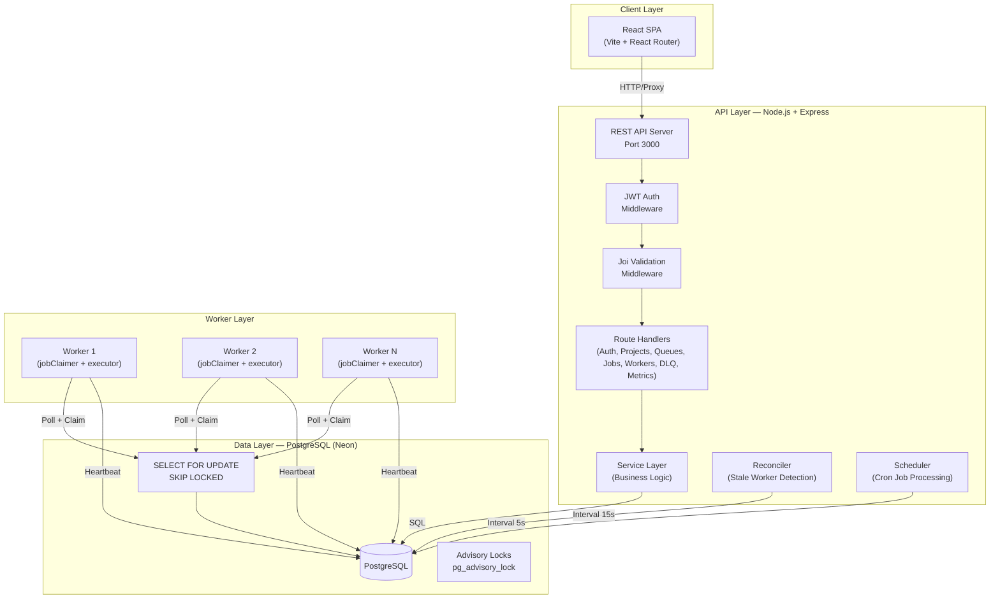

# Architecture — Distributed Job Scheduler

## System Overview



## Component Architecture

### API Server (`backend/src/index.js`)
- Express HTTP server on port 3000
- Middleware chain: Helmet → CORS → JSON parsing → Request logging → Route handlers → Error handler
- Runs reconciler and scheduled job processor as background intervals

### Worker Service (`backend/src/worker/workerProcess.js`)
- Independent process (can be scaled horizontally)
- Registers itself in `workers` table on startup
- Polls assigned queues at configurable interval
- Claims jobs atomically via `SELECT ... FOR UPDATE SKIP LOCKED`
- Executes jobs concurrently up to configurable limit (semaphore pattern)
- Sends heartbeats to `worker_heartbeats` table
- Handles SIGTERM gracefully: stops claiming, finishes in-flight, exits

### Reconciler (`backend/src/reconciler/staleWorkerReconciler.js`)
- Runs inside API server process
- Checks for workers with stale heartbeats every 15 seconds
- Requeues jobs from stale workers back to `queued` status
- Marks stale workers as `offline`

### Frontend (`frontend/`)
- React SPA with Vite build tool
- React Router for client-side routing
- Axios for API calls with JWT interceptors
- Recharts for data visualization
- Lucide React for icons
- CSS custom properties design system (no Tailwind)

## Data Flow

### Job Creation → Execution
```
1. User creates job via REST API → status = 'queued'
2. Worker polls DB → finds queued job
3. Worker claims job (SELECT FOR UPDATE SKIP LOCKED) → status = 'claimed'
4. Worker starts execution → status = 'running'
5a. Success → status = 'completed', record execution
5b. Failure → check retry policy:
    - retries remaining → status = 'retrying', set run_at
    - no retries left → status = 'dead_letter', insert DLQ entry
```

### Stale Worker Recovery
```
1. Worker stops sending heartbeats (crash/network issue)
2. Reconciler detects last_heartbeat > timeout
3. Reconciler requeues all claimed/running jobs → status = 'queued'
4. Worker marked as 'offline'
5. Other workers pick up requeued jobs
```

## Key Design Decisions

| Decision | Rationale |
|----------|-----------|
| Postgres-only (no Redis) | Simplifies deployment, uses advisory locks + SKIP LOCKED for all distributed primitives |
| SELECT FOR UPDATE SKIP LOCKED | Lock-free atomic claiming — workers skip already-locked rows instead of waiting |
| Separate worker process | Can be scaled independently of API server |
| Heartbeat + Reconciler | Detects worker failures without requiring coordination between workers |
| Configurable retry policies | Strategy, delays, and limits stored as database rows — not hardcoded |
| Job status as Postgres ENUM | Prevents invalid states, enables efficient indexing |
