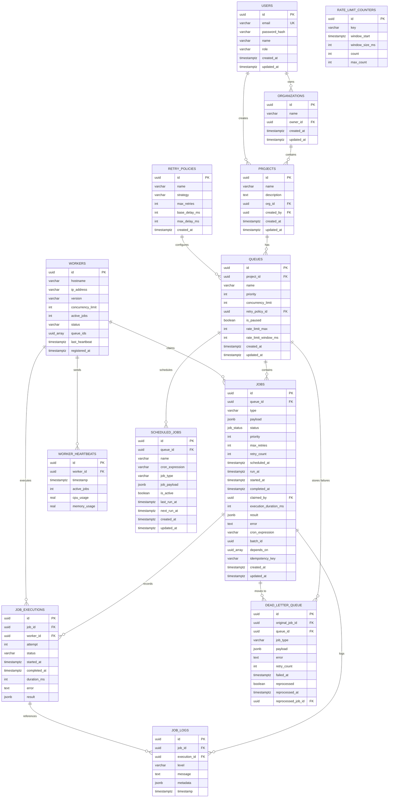

# ER Diagram — Distributed Job Scheduler

## Entity Relationship Diagram

## Key Relationships

| Relationship | Type | Cascade |
|-------------|------|---------|
| Users → Organizations | 1:N | ON DELETE CASCADE |
| Organizations → Projects | 1:N | ON DELETE CASCADE |
| Projects → Queues | 1:N | ON DELETE CASCADE |
| Queues → Jobs | 1:N | ON DELETE CASCADE |
| Jobs → Job Executions | 1:N | ON DELETE CASCADE |
| Jobs → Job Logs | 1:N | ON DELETE CASCADE |
| Workers → Worker Heartbeats | 1:N | ON DELETE CASCADE |
| Jobs → Dead Letter Queue | 1:N | ON DELETE CASCADE |
| Retry Policies → Queues | 1:N | ON DELETE SET NULL |
| Workers → Jobs (claimed_by) | 1:N | ON DELETE SET NULL |

## Indexes

| Table | Index | Purpose |
|-------|-------|---------|
| jobs | `(queue_id, status, run_at) WHERE status IN ('queued', 'retrying')` | Worker polling query optimization |
| jobs | `(status)` | Dashboard status filtering |
| jobs | `(claimed_by) WHERE NOT NULL` | Worker job lookup |
| jobs | `(batch_id) WHERE NOT NULL` | Batch job queries |
| jobs | `(idempotency_key) WHERE NOT NULL` | Idempotent job creation |
| workers | `(status)` | Active worker queries |
| workers | `(last_heartbeat) WHERE status = 'active'` | Stale worker detection |
| worker_heartbeats | `(worker_id, timestamp DESC)` | Heartbeat timeline |
| job_logs | `(job_id, timestamp DESC)` | Job log retrieval |
| dead_letter_queue | `(reprocessed, failed_at DESC)` | Unprocessed DLQ listing |

## Normalization

- **3NF**: All tables are in third normal form
- **Retry policies** are normalized into their own table (not embedded in queues/jobs)
- **Job executions** separate from jobs to maintain full retry history
- **Worker heartbeats** separate from workers for time-series monitoring
